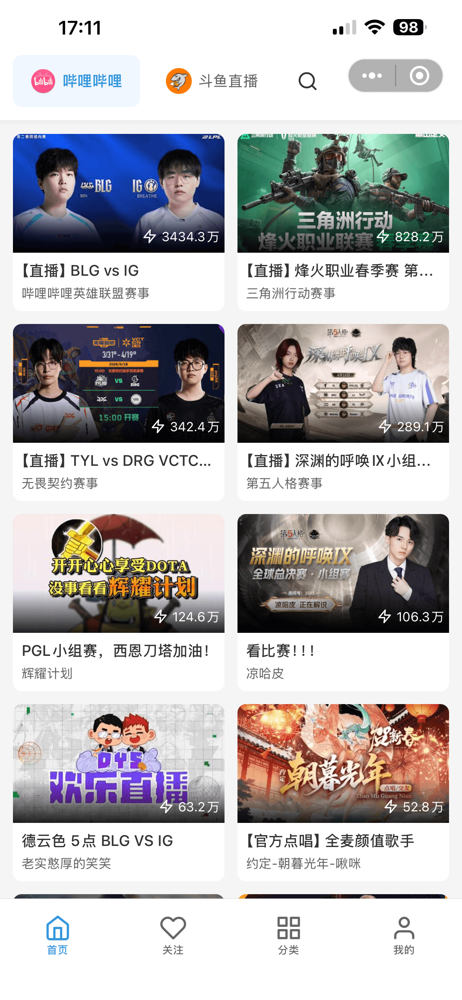
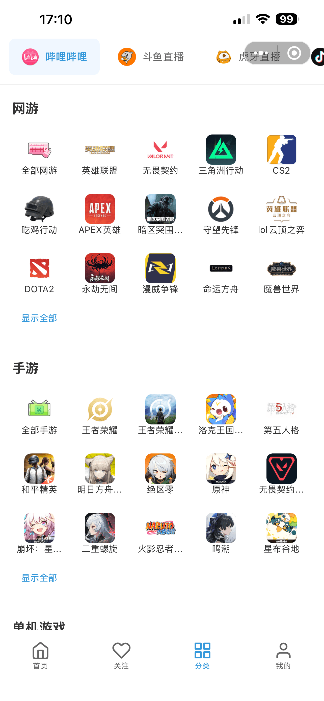
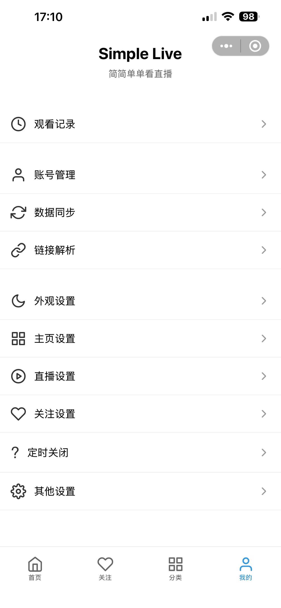

> ### ⚠ 说明
>
> 本仓库为 **红糖云服 App** 内的 **React Native 应用小程序**（直播聚合）。需在宿主 App 中加载资源包，或按下方流程本地编译调试；分发与更新方式以 `app.json` 与官方文档为准。

<h2 align="center">直播基地</h2>

<p align="center">简简单单的看直播 · 红糖云服小程序版</p>

<p align="center">参考 <a href="https://github.com/xiaoyaocz/dart_simple_live"><strong>Simple Live</strong></a>（<code>dart_simple_live</code>）的思路与能力边界，用 React Native 在红糖云服内重新实现。</p>

<p align="center">
  <a href="https://mp.dagouzhi.com/">红糖云服 · 小程序官网</a>
  &nbsp;·&nbsp;
  <a href="https://github.com/htyf-mp-community">GitHub 组织</a>
</p>

## 演示截图

| 首页 | 分类 |
| :---: | :---: |
|  |  |

| 直播间 | 我的 |
| :---: | :---: |
|  |  |

---

## 支持直播平台

- 哔哩哔哩直播
- 斗鱼直播
- 虎牙直播
- 抖音直播

## APP / 运行形态

- [x] **红糖云服 App**（应用小程序，远程 zip 资源）
- [x] **本地开发**：Android / iOS（标准 React Native 工程）

## 项目结构（节选）

| 路径 | 说明 |
|------|------|
| `src/index.tsx` | 小程序入口（宿主加载的根组件） |
| `src/pages/home/` | 首页、房间列表、播放器 `RoomPlayer` 等 |
| `src/pages/home/core/api/` | 各站点拉流 / 房间信息 API（如 `bilibiliSite`、`douyuSite` 等） |
| `src/pages/home/core/danmaku/` | 各平台弹幕连接与解析 |
| `src/router/` | 导航与路由 |
| `app.json` | 红糖云服元数据：`appid`、`zipUrl`、`appUrlConfig`、`htyf` 等 |
| `webpack.config.mjs` / `metro.config.js` | 打包与 Metro / Repack 配置 |

## 环境

| 依赖 | 版本要求（以仓库为准） |
|------|-------------------------|
| Node.js | `>= 20`（见 `package.json` engines） |
| React Native | `0.83.x`（与 `react-native` 依赖一致） |
| 包管理 | 推荐使用 `yarn`（与官方模版一致） |

安装依赖（仓库根目录）：

```bash
yarn
```

## 开发与打包

- **日常调试**：与普通 React Native 项目相同，例如 `yarn start`，再 `yarn android` / `yarn ios`。
- **在红糖云服 App 内体验 / 发版资源包**：

```bash
npm run htyf
```

生成可供宿主拉取的分发包后，将 zip 上传到 `app.json` → `htyf.zipUrl` 所指向的位置，并维护 `appUrlConfig` 中的版本与说明。

### `app.json` 要点（红糖云服）

- **`appUrlConfig`**：线上配置 / 元数据地址（版本、更新说明等）。
- **`zipUrl`**：静态资源 zip 的下载地址。
- 客户端会先拉取配置，再按约定加载 RN 资源包。

## 参考及引用

- **[Simple Live](https://github.com/xiaoyaocz/dart_simple_live)**（`dart_simple_live`）：**本项目即参考该项目开发**——多平台直播、房间与弹幕等能力在其开源实现基础上有取舍与适配；原项目为 Flutter 全端客户端，本仓库为 **React Native**，并作为 **红糖云服应用小程序** 分发，技术栈、工程结构与发布方式均不同，并非官方移植版。
- 其他公开资料（弹幕协议、直播地址解析等）的使用请遵守各平台服务条款与法律法规。

## 声明

本项目功能基于互联网上公开资料与学习交流目的开发。**严禁将本项目用于商业用途**；若用于红糖云服小程序分发，请同时遵守宿主平台与红糖云服的相关规则。

若您认为本仓库内容侵犯合法权益，请联系作者以便及时处理。

## Star History

<a href="https://www.star-history.com/#htyf-mp-community/simple_live&Date">
  <picture>
    <source media="(prefers-color-scheme: dark)" srcset="https://api.star-history.com/svg?repos=htyf-mp-community/simple_live&type=Date&theme=dark" />
    <source media="(prefers-color-scheme: light)" srcset="https://api.star-history.com/svg?repos=htyf-mp-community/simple_live&type=Date" />
    
  </picture>
</a>
